## CSE 581

The below pictures are from my CSE581 3d graphics class at OGI.  Everything
shown below was rendered with a render I built.  Its all written in C++
using Qt as the graphic system.  (Okay, actually the first image was done
under Java, but sadly Java was just too DAMN slow to keep using it.)

This was the first picture in the class.  I had a slight bug/feature
where the eye ended up also being the light source.  It was suppose to
just have an ambient light, no direction.

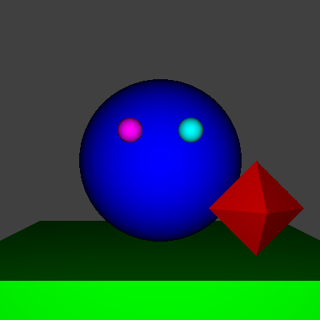

Assignment two, added a light source and specular points.  The big blue
sphere should look *slightly* metallic, and the purple one plastic.

Transparency and reflectivity.  I like this picture.  The two small spheres
are transparent and the big gold one is reflective.

For this one, I finally got moving the damn eye working.

Just an enlarged version of the last picture.

I've added two things to this picture.  The first is the cutting planes 
which gives the sphere a flat edge on the front.  The second is 
a rough anti-aliasing.  This gives some smoothness to the edges.  However,
due to a constant jitter you can still see some banding.

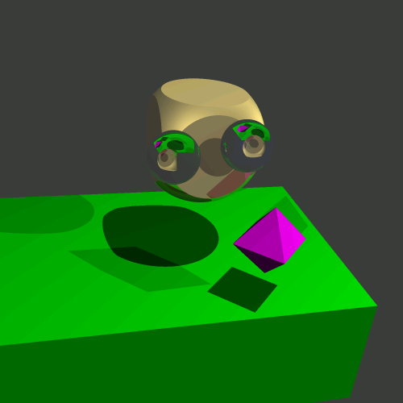

As it turned out, I had a bug in the previous picture which was causing
only 3 faces of the sphere to be "cut".  This one has a cutting plane on
all six sides, as you can see from the shadow.

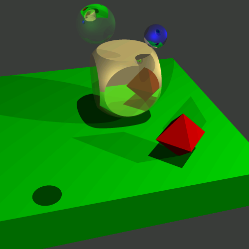

A very big image with my elliptical cone added.  I was using this as my 
background image on my desktop for a while.

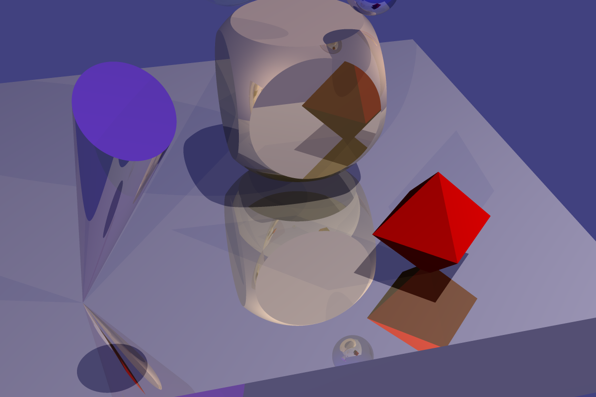

I can't say I like this image very much.  This one was done using an 
exact focus at 0,0,0 rather than a fix focus as the other images were
done.  The only thing I do like about the image is the blur helps the
red diamond look like its standing up a bit better.

This was rendered using a very basic texture on the sphere.  Its using 
the "real" up and side vectors and not the natural as it should.  

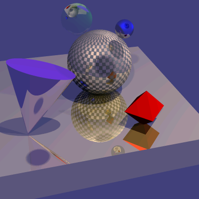

In this one I have added my cutting planes back on and now the fact that
the up and side vectors are not using the natural coordinates is easier
to see.  I still like the image though.

Now I am starting to look into tracing caustics.  Because of the way
ray tracing traditionally works this ends up being sort of a pain.  So rather
I'm playing around with photon mapping.  Here is a simple image rendered
with my basic ray tracer.  A lot has been ripped out, namely reflective
surfaces, transparent object and others.

This is my first rendered image with photon mapping.  Notice the soft shadows.
The weird texture is an artifact of the way I am sending out my light rays.
Currently they are being wrapped in a box.  This is causing the odd pattern.
Using a sphere would be better, but a real pain.

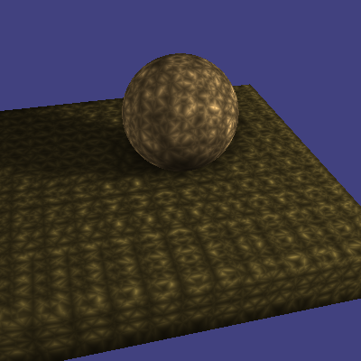

Its caustics.  After screwing around for a while trying to get global
illuminaton working with photon mapping I gave up and just map the 
photons for those things of *interest*.  Its not finished yet as the caustic
should really be tainted green as it goes through the greenish crystal ball.  

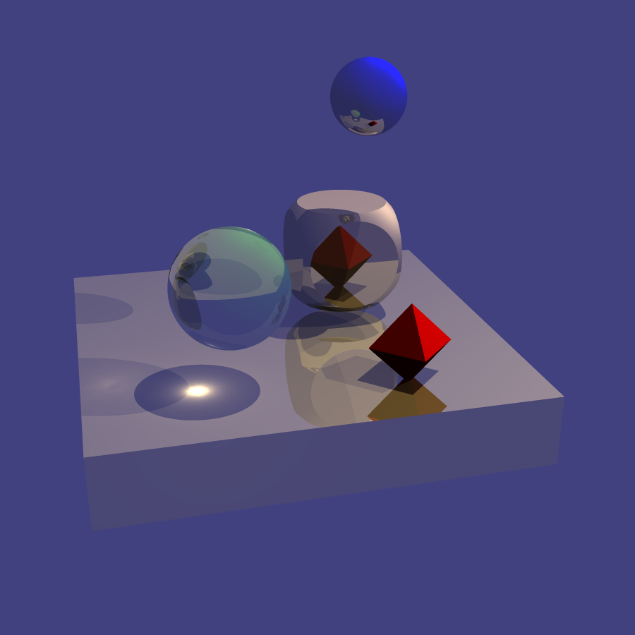

So as it turned out the above image was wrong.  The focus point for a 
caustic when passing through a sphere is much closer to the sphere than
the above picture would lead you to belive.  This one has been fixed.
This picture, and all others below, were presented as part of my final 
project on caustics in my CSE581 class.

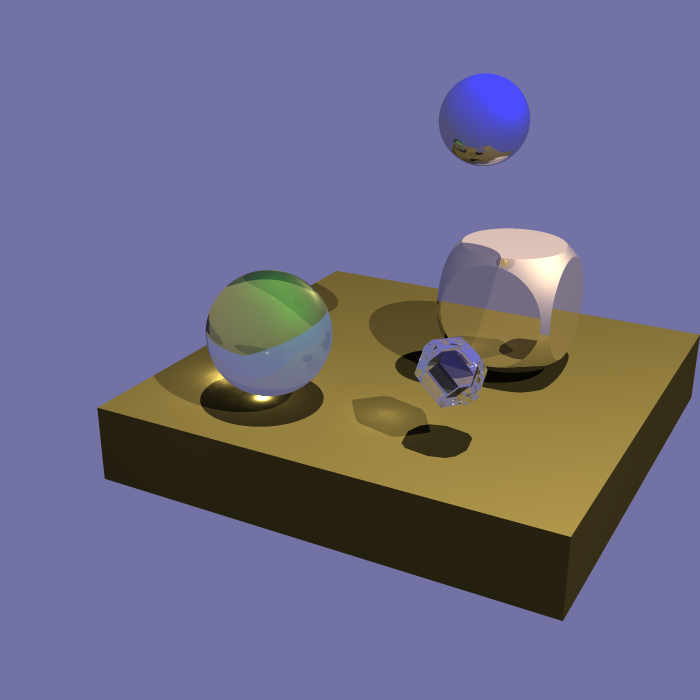

Next I tried to replace the sphere with my eliptical cone.  The caustic
forms as one would expect in a line under the cone.

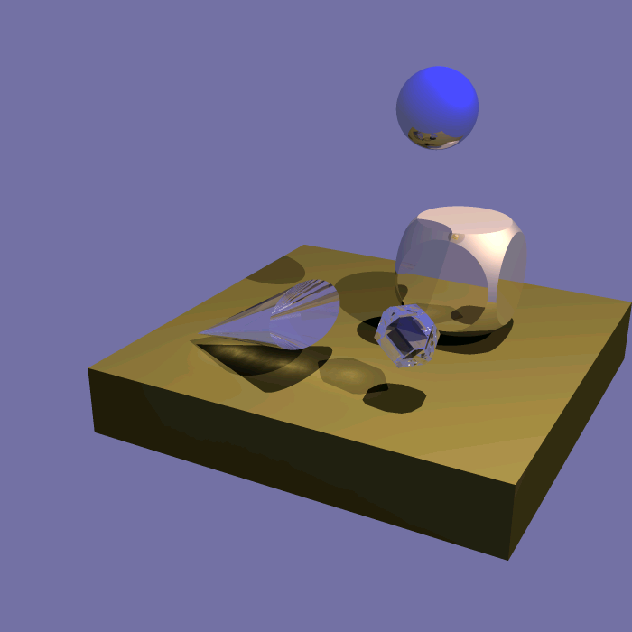

Next I showed that even if we use two different colored lights the
caustics still show as you would expect, one in green (from the green
light) and the other in red ( from the red light ).  Notice the greenish
halo around the caustic formed through the jewel as light is scattered. 

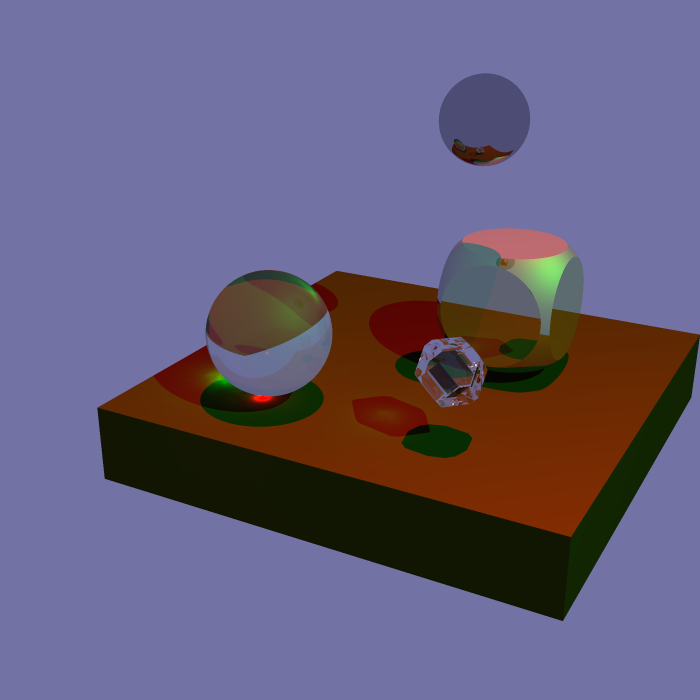

Here is my eliptical cone again with the two colored lights.  Notice how
the caustic from the cone changes from mostly green to nearly equal 
green and red as the two caustics intersect. 

I think I was trying to show a different intensity for one of the lights 
in this picture.  

I was sort of bugged by the jewel not having any caustic in the shadow 
created directly below it so I moved my sphere into its location to 
make sure there was not something wrong with my light source.  Nope, looks
good.

Although I neglected to render this picture with super sampling it ended
up being one of my favorite images.  I have taken the basic sphere and 
cut it in half to increase the distance to the caustic focal point.  Then
I put a "highly reflective" surface directly behind the object and used
only one light.  The result is the caustic created bounces off the mirror
and ends up almost directly under the object.

So why four caustics?  Two are just reflections of the other two.
So why two caustics from only one light source and one object.  Well,
the first is produced as you would expect by going through the object and
then bouncing off the mirror.  The other is created by the light which first
bounces off the mirror and *then* goes through the object.  Cool huh.

Also notice how the surface is not 100% reflective so some of the
light gets absorbed on the mirror rather than being bounced.  To see this, 
look for the slight bright spot on the mirror.

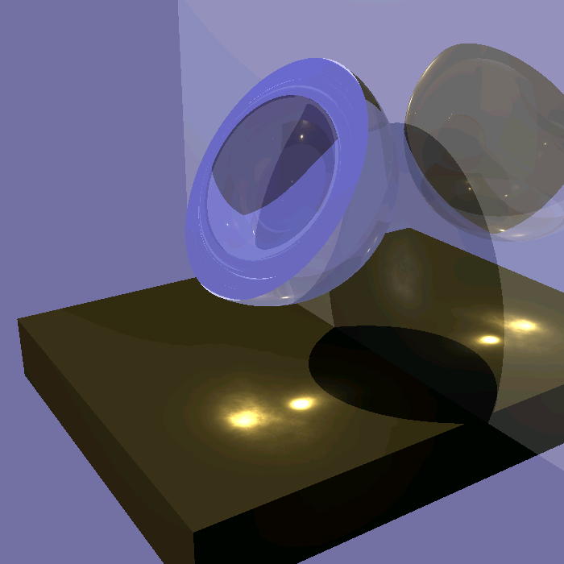

This last image was done to show how the caustic passes through a
semi transparent object.  Same setup as above with the half sphere and
single light source.  The only diffence is that this time the caustic
passes through a piece of glass.  Again, notice how the glass is not
100% transparent so some of the light gets absorbed rather than
just passing through.

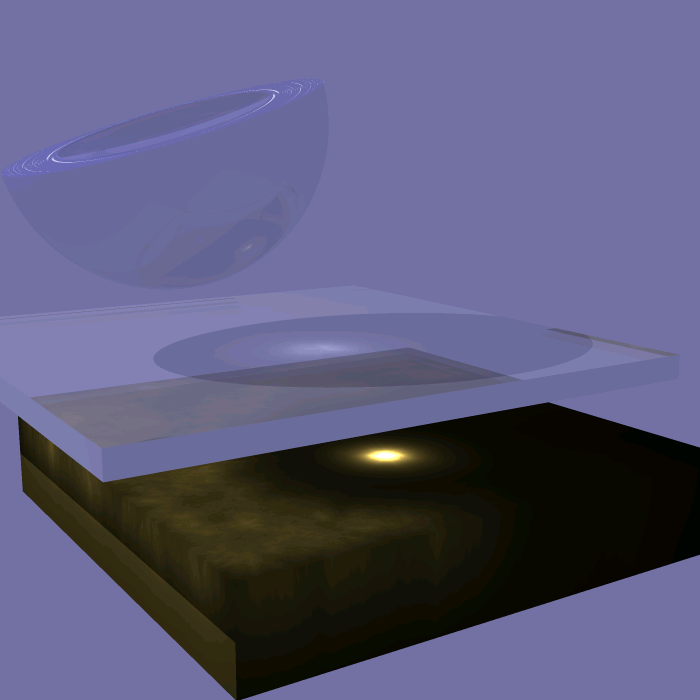
